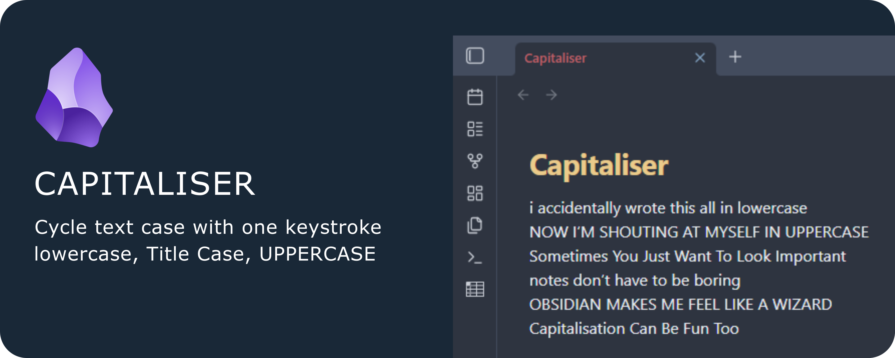

# Capitaliser

Effortlessly cycle the capitalisation of your text in Obsidian - just like what Shift+F3 does in Microsoft Word. Instantly switch between lowercase, Capitalise Each Word, and UPPERCASE with a single command and your favourite hotkey.

---

## ✨ Features

- **Cycle capitalisation**: Transform selected text or the current word between lowercase, Capitalise Each Word, and UPPERCASE.
- **Smart selection**: Works with selections, single words, or entire lines.
- **No setup required**: Assign any hotkey you like in Obsidian’s settings.
- **Fast & lightweight**: No dependencies, instant results.

---

## 🚀 Getting Started

1. Install **Capitaliser** from the Community Plugins browser in Obsidian.
2. Enable the plugin in Obsidian’s settings.
3. Assign your favourite hotkey to the “Cycle text capitalisation” command.

---

## 💡 Usage

- Select text, place your cursor in a word, or select an entire line.
- Trigger the command (via hotkey or command palette).
- Watch your text cycle through lowercase, Capitalise Each Word, and UPPERCASE.

---

## ☕ Support & Contributions

If you find this plugin helpful, consider [buying me a coffee](https://ko-fi.com/hardpath) to support future development!
